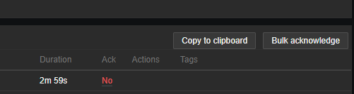

# Zabbix 3: Helper
Uma extensão do google chrome para adicionar algumas pequenas melhorias ao zabbix e facilitar/agilizar o meu fluxo de trabalho. 

# Como instalar:
- Baixe o conteúdo do repositório e descompacte em alguma pasta do computador,
- No google chrome vá em configurações>extensões
- Habilite o modo desenvolvedor no canto superior direito
- Click no botão "Carregar sem compactação", e selecione a pasta com os arquivos baixados. 

# Como usar o botão 'copy to clipboard':
- Selecione os alarmes que deseja copiar através das caixas de seleção
- Click em copy to clipboard para copiar seu conteúdo no formato tabela (BB Code)
- No bitrix click na opção BB Code e depois cole o código, click novamente em BB Code para vizualizar a tabela.

## Ctrl Click
- Ctrl Click em copy to clipboard copia apenas o texto com uma quebra de linha para cada alarme, para quando não é possível utilizar BB Code (whatsapp por exemplo)
